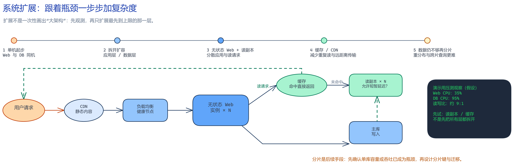

# 从一台机器扩展服务

**一句话概括：** 当一台机器开始扛不住请求时，把压力拆到合适的层和多台机器上。

## 业务问题

一个应用刚上线时，网页服务和数据库放在一台机器上很简单；用户变多后，CPU、内存、网络或数据库先后成为瓶颈。

图源：[可编辑 Excalidraw 文件](../diagrams/scale-with-measurement.excalidraw)

## 为什么需要它

把 Web 服务与数据库分开，可以分别扩容；多台无状态 Web 服务器前放负载均衡器，可以把请求分开并在故障时绕开坏机器。读多写少时，数据库副本能分担读取。

## 为什么不用更简单的方案

先给机器加 CPU 和内存（垂直扩展）通常最省事，适合早期。但机器有上限，也会成为单点。水平扩展提高容量和冗余，却增加网络、部署和数据一致性复杂度，不能一开始就盲目拆分。

## 它怎么工作

先分离应用和数据，再用负载均衡器分发请求；让应用服务器不保存只能由本机读取的会话状态；需要时再加入缓存、CDN、数据库副本或分片。每一步都针对已观察到的瓶颈。

## 会怎么坏

读副本可能落后；缓存可能返回旧数据；分片会让跨分片查询和迁移更难。多机并不自动等于高可用，还要验证健康检查、故障切换和恢复流程。

## 我怎么验证它

逐层压测并观察 CPU、网络、数据库连接数、查询延迟和错误率。模拟一台 Web 服务器或一个副本不可用，确认请求能否继续，以及读到的数据是否满足业务要求。

## 记住这几件事

- 先测出瓶颈，再扩展对应层。
- 无状态应用更容易横向扩展。
- 副本、缓存和分片都带来新的正确性问题。

原章节：[从零扩展至百万级用户](./Readme.zh-CN.md)
