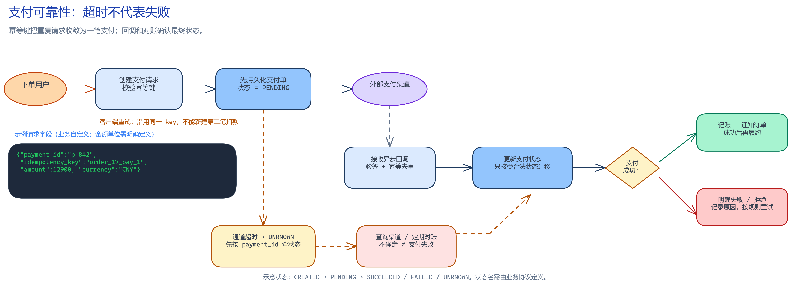

# 支付系统

**一句话概括：** 在网络重试和外部渠道不稳定时，仍能准确记录一笔钱发生了什么。

## 业务问题

用户点击支付后可能超时，但银行或支付渠道其实已扣款；再次提交可能导致重复扣钱。

图源：[可编辑 Excalidraw 文件](../diagrams/payment-idempotency-and-reconciliation.excalidraw)

## 为什么需要它

支付需要可靠状态流转、重复请求保护、账务记录和对账，不能只看一次 HTTP 返回值。

## 为什么不用更简单的方案

直接改订单状态最简单，却无法解释资金去向，也难以发现遗漏或重复。账本和事件记录增加实现成本，但能支持审计与纠错。

## 它怎么工作

用幂等键创建支付意图；调用渠道后保存请求和回执；异步处理回调并校验签名；通过账本记录借贷分录；定期与渠道账单对账。

## 会怎么坏

回调重复或乱序、渠道已扣款但本地超时、退款部分成功都可能让状态不一致。支付状态不能只靠客户端重试推断，需查询或对账确认。

## 我怎么验证它

注入超时、重复回调、签名错误和部分退款；用渠道模拟账单与内部账本对账，确认差异能被发现并追踪。

## 记住这几件事

- 幂等键防重复执行。
- 账本记录资金变化，状态字段不能替代它。
- 回调、查询和对账共同确认最终结果。

原章节：[支付系统](./README.zh-CN.md)
